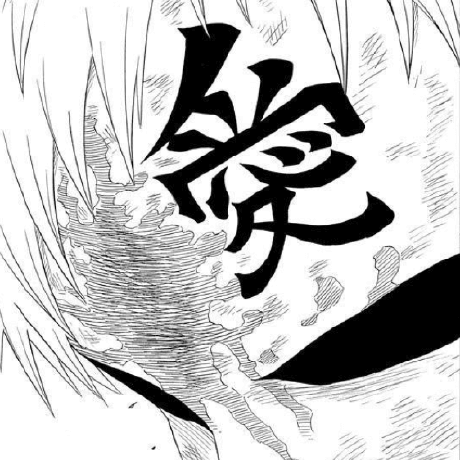

# 博客加密测试  <!-- # 手动指定 h1 标题 -->
## 链接
- [mkdocs-encryptcontent-plugin](https://github.com/coink0in/mkdocs-encryptcontent-plugin)


## 代码
<details>
<summary>配置文件</summary>
```yaml title="mkdocs.yml" linenums="1" hl_lines="3 4 5 6 7 8 9"
plugins:
    - encryptcontent:
        title_prefix: '🔒'
        summary: 'This content is protected with AES encryption'
        placeholder: 'Enter your password'
        decryption_failure_message: 'Wrong password'
        encryption_info_message: 'Contact iydon for access to this page'
        remember_password: True
        decrypt_search: False
```
</details>


## 公式
```math
f(x) = \int_{-\infty}^\infty
    \hat{f}(\xi) \, e^{2\pi i\xi x} \, d\xi
```


## 表格
|Package|Suggested Versions|
|---|---|
|NVIDIA Windows Driver x86 - CUDA, Video<br />Nvidia-smi (Limited Feature Set)|R495 and later Windows production drivers will officially support WSL2 on Pascal and later GPUs.<br />For the latest features use WSL2 driver published on CUDA Developer Zone.|
|NVIDIA Container Toolkit|Minimum versions - v2.6.0 with libnvidia-container - 1.5.1+|
|CUDA toolkit|Latest CUDA toolkit from 11.x releases can be used. Developer tools: Debuggers and Profilers are not supported yet.|
|NCCL|2.11.4+|


## 图片
<p align="center">
  
</p>
