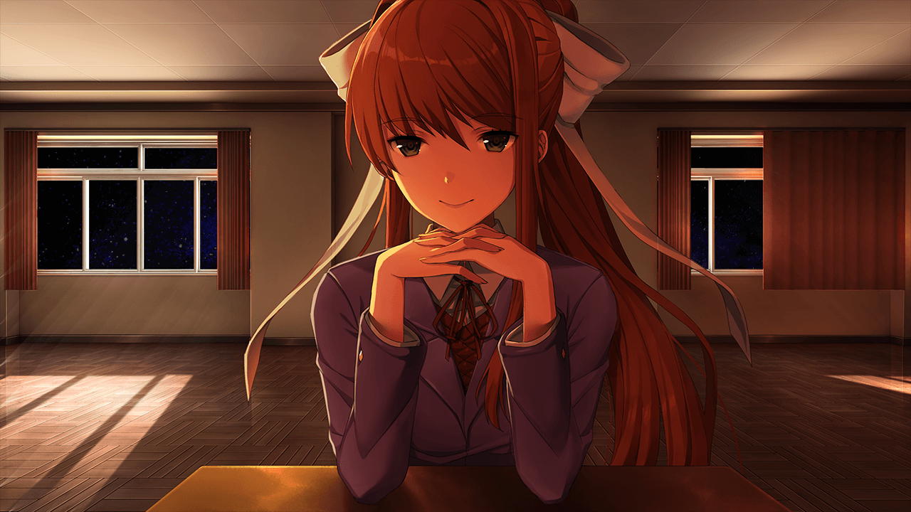

<link rel="stylesheet" href="../../../assets/stylesheets/plyr.css" />

## 基础信息
- [主页](https://ddlc.moe)
- [Steam](https://store.steampowered.com/app/698780/Doki_Doki_Literature_Club)

## 相关资源
### 音频
<audio id="player">
    <source src="../../../assets/audio/ddlc.mp3" type="audio/mp3" />
</audio>

### 图片

  

### 文件
- [monika.chr](../../assets/other/monika.chr): a file that's present in the characters folder of the game directory.
